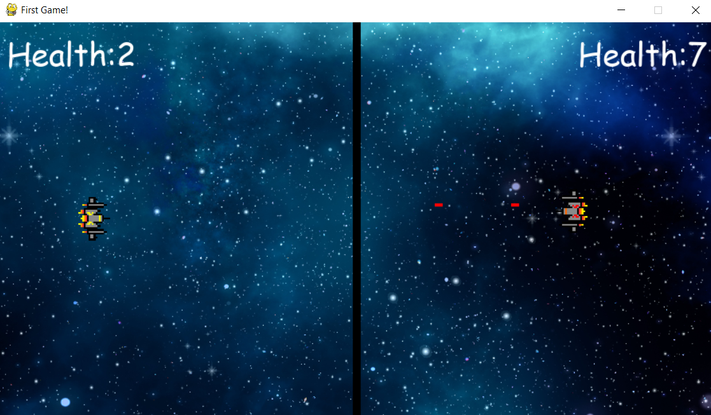

# Space Battle Game

Welcome to **Space Battle Game**! This is a two-player game where each player controls a spaceship and tries to shoot down the opponent. The game features cool sound effects and smooth controls for an engaging experience.

## Table of Contents

- [Game Description](#game-description)
- [Features](#features)
- [Installation](#installation)
- [How to Play](#how-to-play)
- [Controls](#controls)
- [Acknowledgements](#acknowledgements)
- [License](#license)

## Game Description

In this game, two players battle it out in space with their spaceships. The goal is to hit your opponent with bullets while avoiding their attacks. Each player has a limited number of bullets and health points. The game ends when one player's health reaches zero, declaring the other player as the winner.

## Features

- Two-player gameplay
- Smooth spaceship controls
- Bullet firing with sound effects
- Health tracking and winner announcement
- Cool space-themed background

## Installation

To run this game on your local machine, follow these steps:

1. **Clone the Repository:**
   ```bash
   git clone https://github.com/your-username/space-battle-game.git
2. **Navigate to the Game Directory:**
    ```bash
    cd space-battle-game
3. **Install the Required Dependencies:**
    ```bash
    pip install -r requirements.txt
4. **Run the Game:"
    ```bash
    python demo.py

## How to Play

### Objective
Shoot your opponent's spaceship until their health reaches zero.

### Players
Two players control one spaceship each.

### Controls

#### Player 1 (Yellow Spaceship)
- Move Left: A
- Move Right: D
- Move Up: W
- Move Down: S
- Shoot: Left Ctrl

#### Player 2 (Red Spaceship)
- Move Left: Left Arrow
- Move Right: Right Arrow
- Move Up: Up Arrow
- Move Down: Down Arrow
- Shoot: Right Ctrl

## Acknowledgements

This game was created using the Pygame library. Special thanks to the contributors of Pygame for making such an awesome tool for game development.

   
